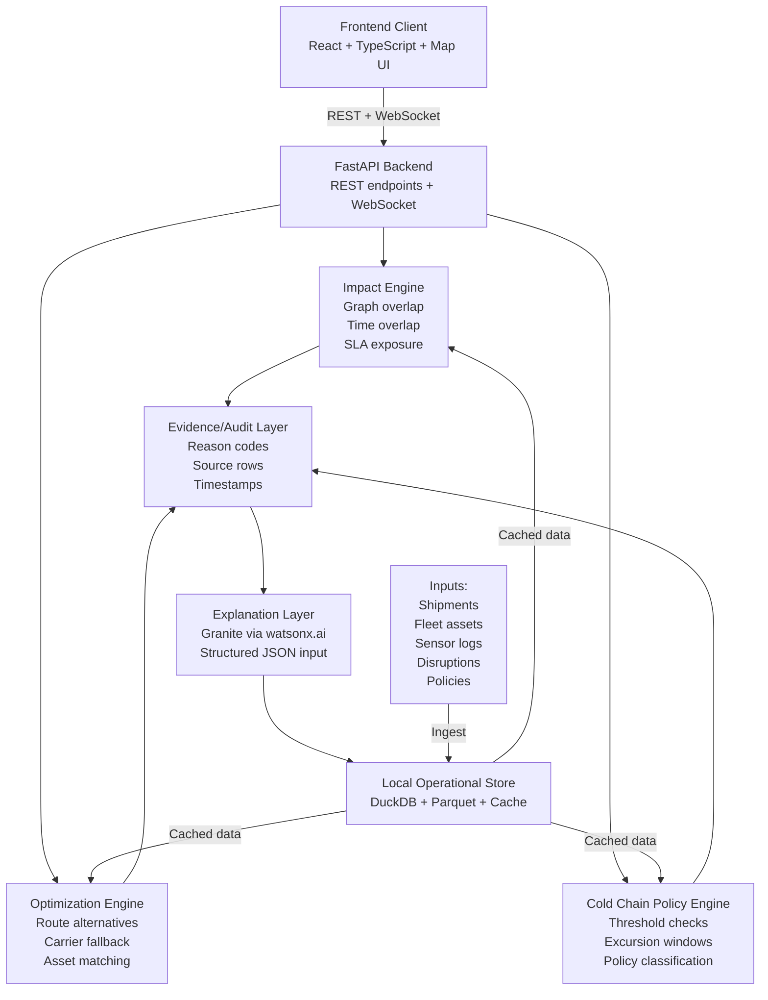

# Architecture

## System Diagram



## Component Responsibility Table

| Component | Technology | Responsibility |
|-----------|-----------|-----------------|
| **Frontend** | React + TypeScript + Vite | Crisis overview, impact map, shipment detail, action center, cold-chain monitor, evidence drawer, export |
| **API Gateway** | FastAPI | REST endpoints, WebSocket, request validation, response serialization |
| **Impact Engine** | NetworkX + GeoPandas | Graph construction, disruption zone intersection, shipment route matching, time-window overlap, SLA exposure calculation |
| **Optimization Engine** | Google OR-Tools | Route alternative generation, carrier fallback, asset matching, constraint satisfaction (capacity, deadline, reefer capability) |
| **Cold Chain Engine** | Python + Pydantic | Sensor log processing, policy profile loading, threshold checking, excursion detection, severity classification |
| **Evidence/Audit Layer** | Python + JSON | Reason code generation, source data linking, audit event recording, decision trail |
| **Explanation Layer** | IBM watsonx.ai (Granite 3.3 8B) | Structured result explanation, incident summary, human-readable action plan, uncertainty disclosure |
| **Data Store** | DuckDB + Parquet | Shipment data, asset inventory, sensor logs, policy profiles, cached route graph, demo fixtures |
| **Deployment** | Docker Compose | Local containerized deployment, service orchestration, volume management |

## Data Flow: End-to-End Walkthrough

### Phase 1: Initialization

1. **Data ingestion:** Shipment CSV, fleet asset CSV, sensor logs, policy profiles, and route graph are loaded into DuckDB and cached as Parquet files.
2. **Schema validation:** Pydantic validators check required fields, data types, and referential integrity.
3. **Normalization:** Timestamps are converted to UTC, units are normalized (Celsius, kilograms), and coordinates are validated.
4. **Graph construction:** Route graph is built from hub/depot locations and route segments. Disruption zones are registered as geometric overlays.

### Phase 2: Disruption Activation

1. **Operator action:** Operator selects a disruption scenario (e.g., "PORT_STRIKE_01") and activates it via the UI.
2. **API call:** Frontend sends `POST /api/v1/disruptions/activate` with disruption ID.
3. **Disruption registration:** Backend loads disruption record (geometry, time window, affected nodes/edges).
4. **Impact calculation:** Impact Engine queries DuckDB for all shipments and checks:
   - Does the shipment's planned route intersect the disruption geometry?
   - Does the disruption time window overlap the shipment's transit window?
5. **Affected shipment list:** Impact Engine returns a list of affected shipments with reason codes (e.g., `PORT_NODE_BLOCKED`, `ETA_SLA_BREACH`).

### Phase 3: Shipment Detail and Alternatives

1. **Operator action:** Operator opens a shipment detail view.
2. **API call:** Frontend sends `GET /api/v1/shipments/{shipment_id}`.
3. **Data retrieval:** Backend queries DuckDB for shipment, legs, current location, cargo value, temperature policy, and sensor logs.
4. **Alternative generation:** Optimization Engine calls OR-Tools to generate feasible route alternatives:
   - Remove or penalize disrupted edges.
   - Apply hard constraints (capacity, deadline, reefer capability, carrier availability).
   - Rank by arrival delay, cost, and risk.
5. **Carrier fallback:** For each alternative route, check carrier availability and equipment compatibility.
6. **Response:** Backend returns ranked alternatives with cost, delay, and risk estimates.

### Phase 4: Idle Asset Matching

1. **API call:** Frontend sends `GET /api/v1/assets/idle`.
2. **Asset query:** Backend queries DuckDB for idle assets (status = "available", current_node_id, available_at).
3. **Compatibility check:** For each affected shipment, filter idle assets by:
   - Mode compatibility (truck for road, container for rail/sea).
   - Reefer capability (if cargo requires temperature control).
   - Capacity (weight and volume).
   - Availability time (can reach origin before planned departure).
4. **Ranking:** Assets are ranked by repositioning distance and utilization potential.
5. **Response:** Backend returns compatible idle assets with reposition distance and ETA.

### Phase 5: Cold-Chain Evaluation

1. **API call:** Frontend sends `GET /api/v1/cold-chain/{shipment_id}/timeline`.
2. **Sensor log retrieval:** Backend queries DuckDB for sensor readings for the shipment.
3. **Policy loading:** Backend loads the temperature policy profile for the shipment's product class.
4. **Excursion detection:** Cold Chain Engine processes sensor readings:
   - Sort by timestamp.
   - Identify readings outside policy range.
   - Calculate duration and cumulative excursion.
   - Detect patterns (spike, drift, door-open, sensor failure).
5. **Classification:** Excursion is classified based on policy rules (e.g., `EXCURSION_REVIEW`, `URGENT_ESCALATION`).
6. **Response:** Backend returns sensor timeline, policy range, excursion events, and classification.

### Phase 6: Evidence and Audit

1. **Evidence recording:** For each decision (affected shipment, route recommendation, asset match, cold-chain classification), the Evidence Layer records:
   - Decision ID (UUID).
   - Timestamp.
   - Input data (shipment ID, disruption ID, policy ID).
   - Reason codes.
   - Output (recommendation, classification).
   - Confidence score.
2. **Audit trail:** All evidence records are persisted to DuckDB and optionally to Cloudant.

### Phase 7: Explanation Generation

1. **API call:** Frontend sends `POST /api/v1/explanations/generate` with decision ID.
2. **Evidence retrieval:** Backend retrieves the evidence record from DuckDB.
3. **Prompt construction:** Backend constructs a structured JSON prompt for Granite:
   ```json
   {
     "shipment_id": "SHP-0042",
     "disruption": "PORT_STRIKE_01",
     "reason_codes": ["PORT_NODE_BLOCKED", "ETA_SLA_BREACH"],
     "recommended_route": {
       "carrier": "Carrier B",
       "eta_delta_hours": 5.4,
       "additional_cost_usd": 1800
     },
     "cold_chain": {
       "status": "EXCURSION_REVIEW",
       "max_celsius": 10.4,
       "policy_max_celsius": 8.0
     }
   }
   ```
4. **Model inference:** Backend calls watsonx.ai with a 2.5-second timeout.
5. **Fallback:** If watsonx.ai times out or fails, backend uses a deterministic template.
6. **Response:** Backend returns structured explanation (summary, why_affected, recommended_action, evidence, uncertainties).

### Phase 8: Action Plan Export

1. **API call:** Frontend sends `POST /api/v1/action-plan/export` with format (JSON or Markdown).
2. **Plan compilation:** Backend aggregates all decisions (affected shipments, alternatives, assets, cold-chain incidents) into a single action plan.
3. **Serialization:** Plan is serialized to JSON or Markdown with evidence links.
4. **Response:** Backend returns the action plan for download or display.

## Critical Design Constraints

- **Offline operation:** All core logic must work with `WATSONX_ENABLED=false`, `NETWORK_REQUIRED=false`, and `DEMO_MODE=true`.
- **Deterministic core:** Disruption impact, route feasibility, and cold-chain classification must be reproducible and auditable.
- **Evidence links:** Every recommendation must include reason codes and source data.
- **Timeout protection:** External API calls (watsonx.ai, Cloudant) must have timeouts and fallbacks.
- **No hardcoded secrets:** API keys, credentials, and sensitive data must be loaded from environment variables or `.env` files.
